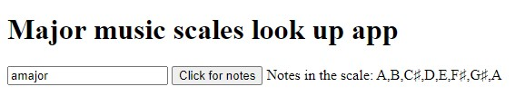

# Music scales look up app
Full stack app used to look up music scales

**Link to project:** https://major-music-scales-app.herokuapp.com/

## How It's Made:

**Tech used:** HTML, CSS, JavaScript, Node / Express, MongoDB, Heroku

Made front end HTML / JS myself. Created a MongoDB database with a collection of music scales. Currently only major scales, will add more as time goes on.
Deployed through Heroku. With Heroku free tiers ending, will need to redeploy elsewhere.

To-Dos:
Add image of notes in staff sheet notation.
Add image of bass / guitar with notes on body

## Optimizations

First had client side and server side in seperate files, failed to load on Heroku. Added front end to this file in public folder

## Lessons Learned:

Lesson 1: use public folder for client side html / JS in public folder, make one comkplete project

